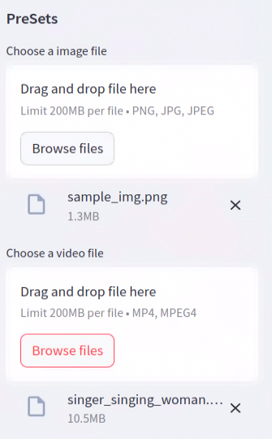
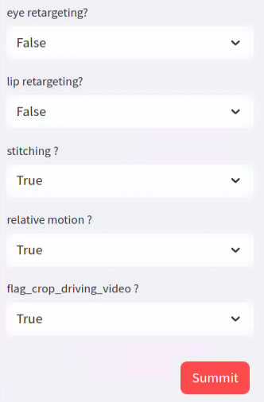

# Live_expression
This project enables live expression modeling with Streamlit and FastAPI integration. For further details about the model checkpoints and LivePortrait, visit the original repository [here](https://github.com/KwaiVGI/LivePortrait).

# Installation
Ensure you have the following versions installed:
- Python: 3.10
- PyTorch: 2.3.0
- Streamlit: 1.38.0
- FastAPI: 0.111.1

## Install Required Libraries
To install the necessary libraries, run the following command:
```
pip install -r requirement.txt
```

# How to run
- Two terminals are required: one to load the server and one to run streamlit.
## Terminal 1: Start FastAPI Server
```
# Terminal 1
python server.py
```
## Terminal 2: Run Streamlit App
```
# Terminal 2
streamlit home.py
```

# image and video upload
- You can upload your images and videos using the interface below:


# LivePortrait option and summit
- Configure the model parameters, then press the Submit button to process the video.<br>

- Setting the parameter and Press the Submit button

# Result video
- Click the link below to view the result:
[Video](./results/sample_img--singer_singing_woman_concat.mp4)


# Notes
- This project utilizes Streamlit for the front-end interface and FastAPI for backend processing.
- Make sure to have compatible versions of the necessary libraries installed to avoid issues.
